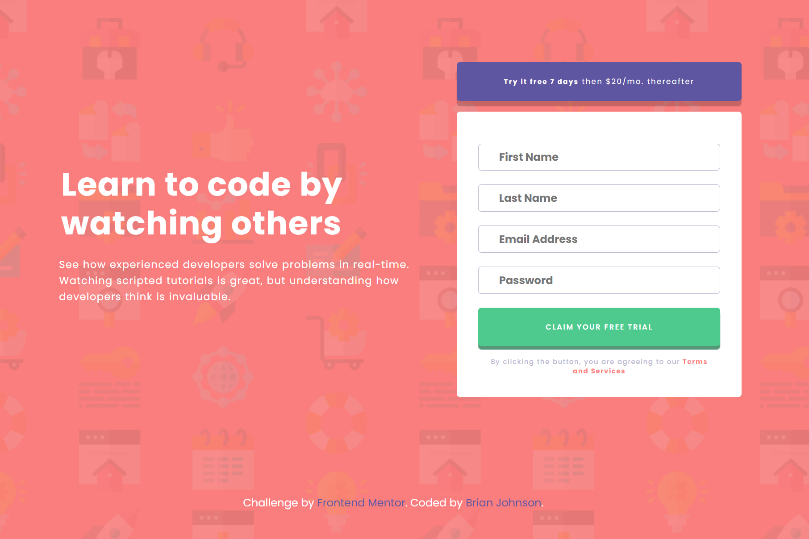

# Frontend Mentor - Intro Component With Signup Form Solution

This is a solution to the [Intro Component With Signup Form challenge on Frontend Mentor](https://www.frontendmentor.io/challenges/intro-component-with-signup-form-5cf91bd49edda32581d28fd1). Frontend Mentor challenges help you improve your coding skills by building realistic projects.

## Table of contents

- [Frontend Mentor - Intro Component With Signup Form Solution](#frontend-mentor---intro-component-with-signup-form-solution)
  - [Table of contents](#table-of-contents)
  - [Overview](#overview)
    - [The challenge](#the-challenge)
    - [Screenshot](#screenshot)
    - [Links](#links)
  - [My process](#my-process)
    - [Built with](#built-with)
    - [What I learned](#what-i-learned)
    - [Continued development](#continued-development)
    - [Useful resources](#useful-resources)
  - [Author](#author)
  - [Acknowledgments](#acknowledgments)

## Overview

Layout the intro component along with the form component for all screen sizes

### The challenge

Users should be able to:

- View the optimal layout for the component depending on their device's screen size
- Making sure the form component buttons and links are accessible

### Screenshot



### Links

- Solution URL: [FEM Solution Link](https://www.frontendmentor.io/solutions/article-preview-component-react-based-BJocjy2U5)
- Live Site URL: [Brian's Deployed](https://intro-with-form-bj.netlify.app/)

## My process

1. First get my google font-family, weights and sizes added to my font.scss partials file
2. Next add the project colors to my colors.scss partials files
3. In my globals.scss partials file, make sure my additional custom property setup is in place
4. Thoughtfully layout the HTML using semantic markup throughout
5. Include in my base & typography styling with Sass
6. Introduce styled components into the mix for easy to access styling within the component JS file
7. Make sure my layout is good on all screen sizes
8. Work on applying my state based styles to the project and my JS logic to hide and show share content
9. Ensure it was all accessible

### Built with

- Semantic HTML5 markup
- CSS custom properties
- Flexbox
- CSS Grid
- Mobile-first workflow
- [React](https://reactjs.org/) - JS library
- [Styled Components](https://styled-components.com/) - For styles

### What I learned

This project helped me to brush up on my JS and react skills. I also learned the basics of using styled components along with Ssss. I learned how to dynamically add attributes to button tags and make them more accessible on click

Here is a piece of code I am most proud of. See below:

```js
/*This piece of code makes my button accessible to screen reader*/
const ArrowWrapper = styled.button`
  border: none;
  outline: none;
  padding: 7px;
  border-radius: 50%;
  cursor: pointer;
`;

const SrOnlyText = styled.span`
  height: 1px;
  overflow: hidden;
  position: absolute;
  width: 1px;
`;

const ArrowContainer = ({ handleModal, isHidden, ariaExpanded }) => {
  return (
    <ArrowWrapper
      className={isHidden ? "arrow__base-color" : "arrow__change-color"}
      onClick={() => handleModal(!isHidden, ariaExpanded)}
      aria-expanded={ariaExpanded}
    >
      <svg
        xmlns="http://www.w3.org/2000/svg"
        width="15"
        height="13"
        aria-hidden="true"
        focusable="false"
      >
        <path d="M15 6.495L8.766.014V3.88H7.441C3.33 3.88 0 7.039 0 10.936v2.049l.589-.612C2.59 10.294 5.422 9.11 8.39 9.11h.375v3.867L15 6.495z" />
      </svg>
      <SrOnlyText>Click on the arrow</SrOnlyText>
    </ArrowWrapper>
  );
};
```

### Continued development

I want to continue developing a fluid workflow that easily integrates Sass and Styled components better than I did on this project. I say this because I noticed that keeping the styled-components in the same file as my JSX was becoming a long file to maintain. Also I want to continue building out more reusable react components so i can build out projects faster. I want to continue developing my accessibility knowledge on knowing when to appropriately used aria attributes with user interaction.

### Useful resources

- [How to Toggle Boolean Value in the state of React Component](http://www.js-craft.io/blog/toggling-a-value-in-the-state-of-a-react-component-the-right-way/) - This article helped me to visually see and then understand how to properly toggle a boolean value for my aria-expanded value on my button on click. I really liked this article and will be referring back to it in future projects.
- [Styled Components](https://styled-components.com/docs/basics#coming-from-css) - I kept returning back to this article for tips on how to use styled components since this was my first time using them in FEM projects.

## Author

- Website - [Brian's Digital Portfolio](https://brianbjohnson.net/)
- Frontend Mentor - [@BrianJ-27](https://www.frontendmentor.io/profile/BrianJ-27)
- LinkedIn - [Brian's LinkedIn Profile](https://www.linkedin.com/in/brian-johnson-45161688/)

## Acknowledgments

Mention fellow developers or people from youtube who you want to acknowledge
